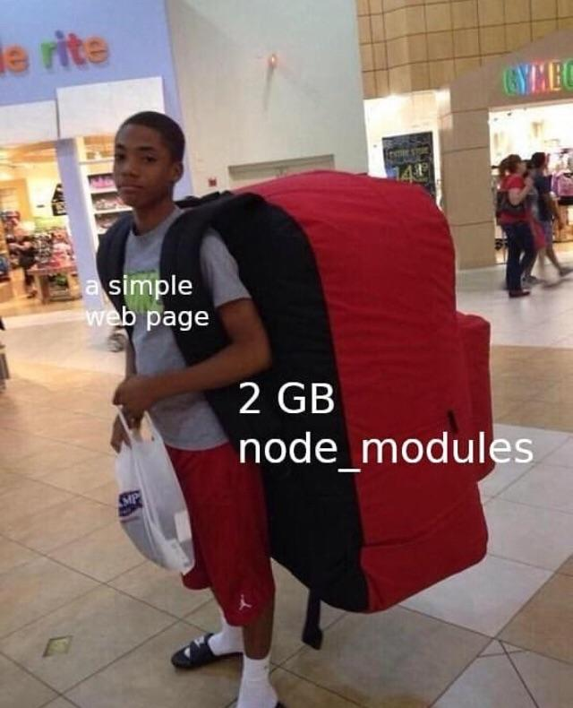

# Programming Memes

## Code

### If it works

### Error on line

### It still works

### My code

### Scared to delete

### It does run

### Your code is shit

## Developers

### Are you sleeping

### I stole your code

### Only god knows

### Just keep googling

### Full Stack

### I can solve a Leetcode hard in 30 min

### Use libraries vs make libraries

### Tutorials I saved vs tutorials I learned

### Searching for a solution instead of reading the docs

### Debugging instead of reading the docs

### Setup of Linus Torvalds

### Yeah I major in computer science

### Fix a typo in the documentation

## Work

### Joining a new company

### Just look at the code

### Skip tests, don’t refactor, code sucks, deliver late

### Deleting a single row from a production database

### 复制粘贴一把梭

### Question in interview

### The technical interview vs the actual job

### Has a buddy that works at the company

### Count lines of code

### Project plan vs project reality

### Day job vs personal project

### Developer's side projects

## IT

### IT infrastructure

## Programming languages

### Most loved language

## Frontend

### Frontend vs backend

### Thanks for inventing JavaScript

### node_modules

### Install with npm

## AI

### ChatGPT can do my job

### Vibe coding

### You are absolutely right

### Programmers worried about AI

### Software development is not just writing code

### Deep Learning

### Generative AI

